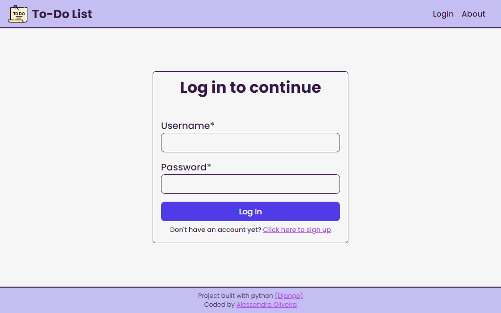
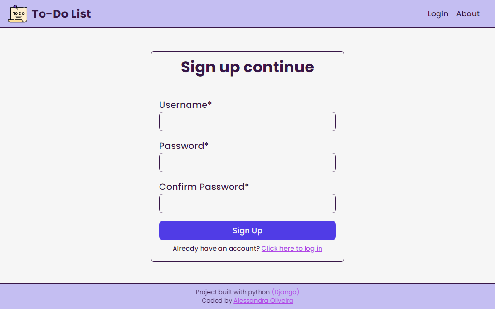
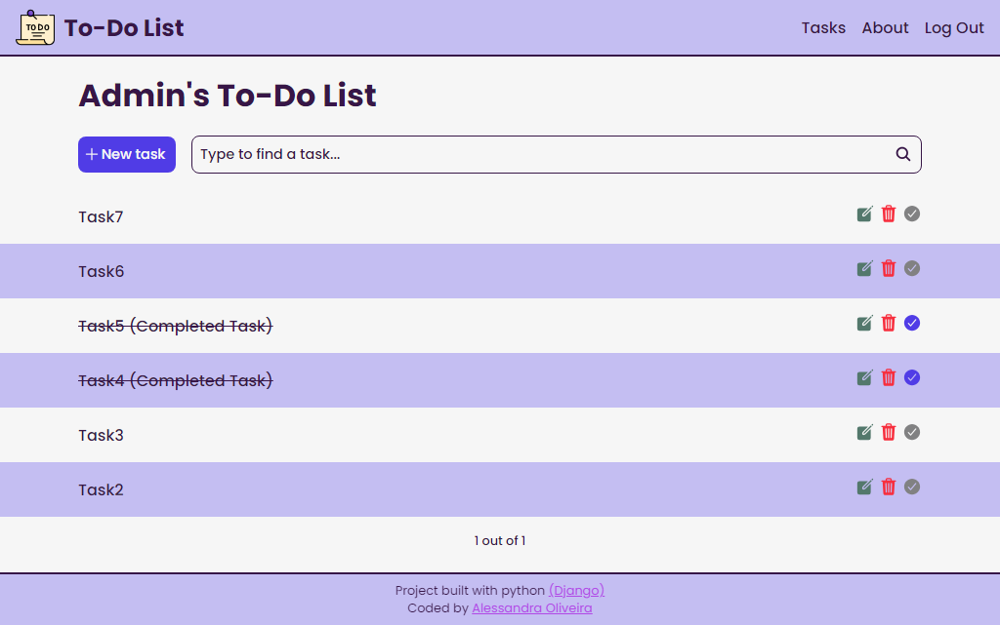
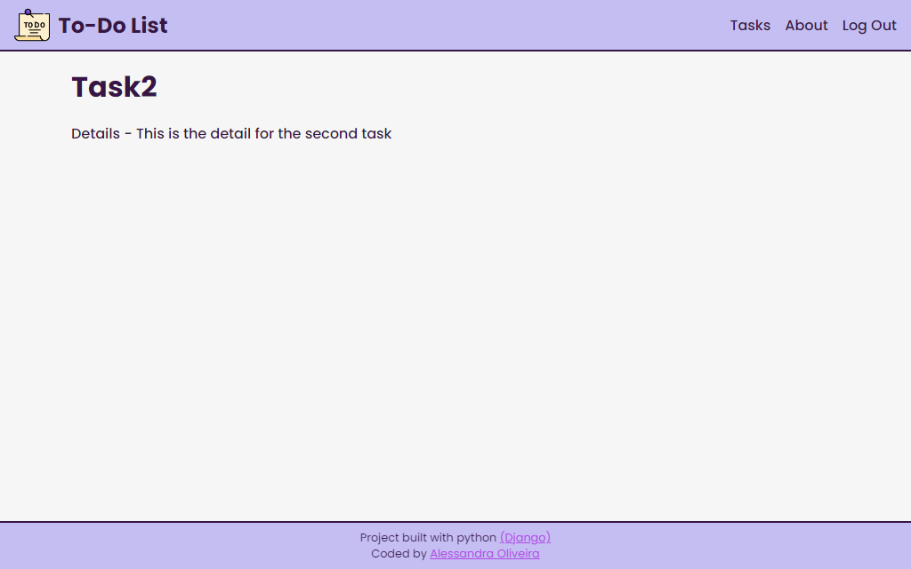
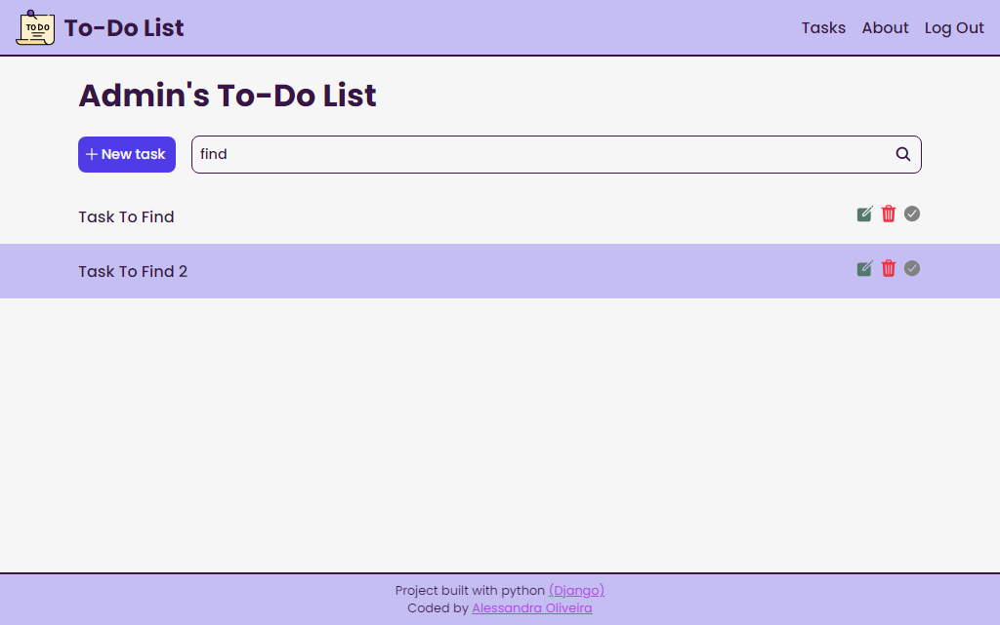
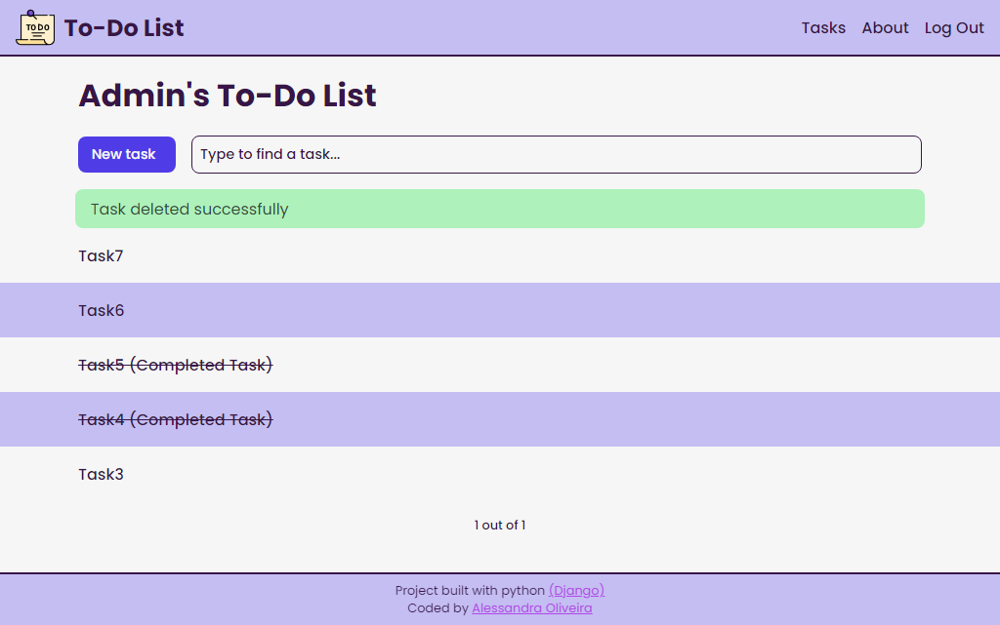

# To-Do List Application

## Table of contents

- [Overview](#overview)
  - [The Project](#the-project)
  - [Screenshot](#screenshot)
  - [Credits](#credits)
- [My process](#my-process)
  - [Built with](#built-with)
- [Author](#author)

## Overview

This project is a to-do list application built entirely with python using Django.

### The Project

How does it work? Like any other "to-do list". Users should be able to:

- Add a new task to their task list;
- Edit an existing task;
- Delete a task (for whatever reason they want to);
- Mark a task as completed;
- Look for a specific task with the search bar by using a key word.

### Screenshot

This is how the app looks like.

**Login:** the first thing the users will see:

  

**SignUp:** if the users don't have an account, they can create one:

  

**Homepage:** once logged in the users will see their homepage with all their tasks:

  

**Details:** the users can see the details fot their tasks by clicking on them. On a real scenario they'll probably see dates, hours, locations and relevant details in general.

  

**Finding a task:** the users can also find a specific task using the search bar an typing a key word.

  

**Deleting a task:** by deleting a task the users will see a success message letting them know the task was deleted.

  

### Credits

This project was based on a similar project developed by [Matheus Battisti](https://horadecodar.com.br/), a brazilian full stack programmer. You can see more of his work by clicking on the links below:

- [Github page](https://github.com/matheusbattisti)
- [Youtube channel](https://www.youtube.com/@MatheusBattisti)

The icon used as logo to the project was built by [Flaticon](https://www.flaticon.com/), an open source plataform that makes icons, stickers, animated icons for free.

## My process

### Built with

This project was entirely built with python, using [Django](https://docs.djangoproject.com/en/5.0/), a python framework used to built web applications.

  

## Author

You can know more about me by following me on social media 

- LinkedIn - [alessandra-santos-oliveira](https://www.linkedin.com/in/alessandra-santos-oliveira/)
- Twitter - [@itsale_o](https://www.twitter.com/itsale_o)
